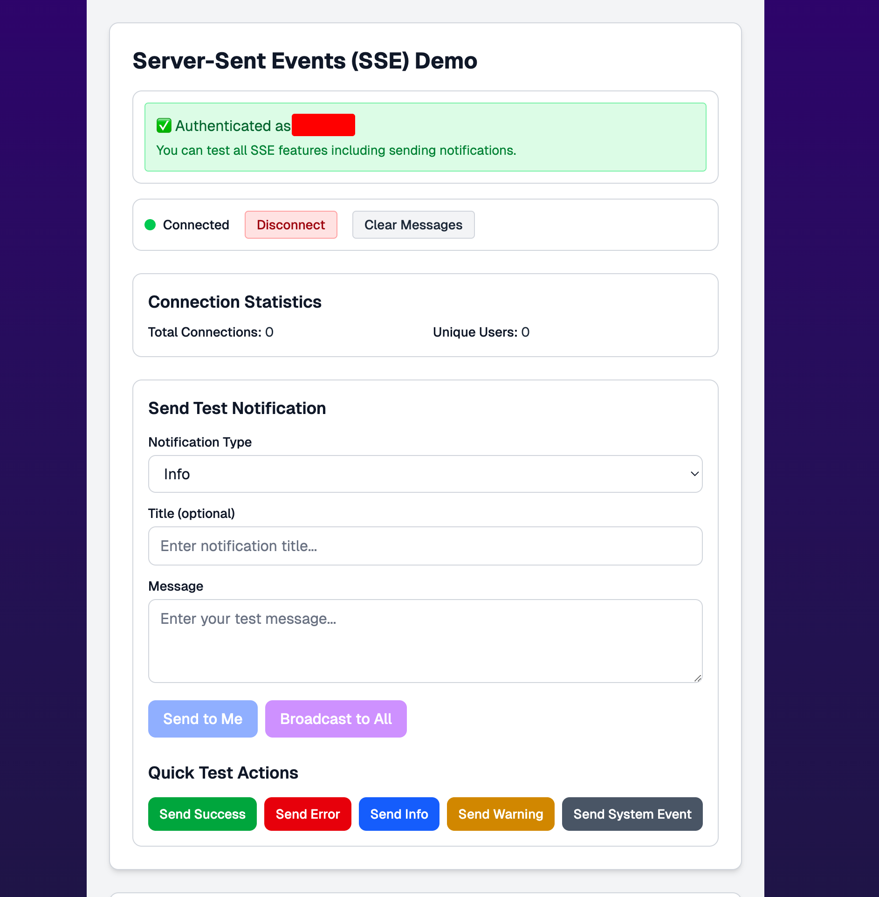
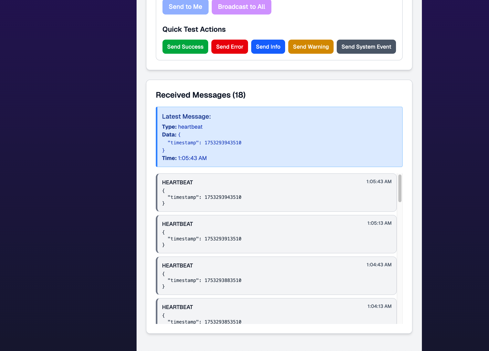
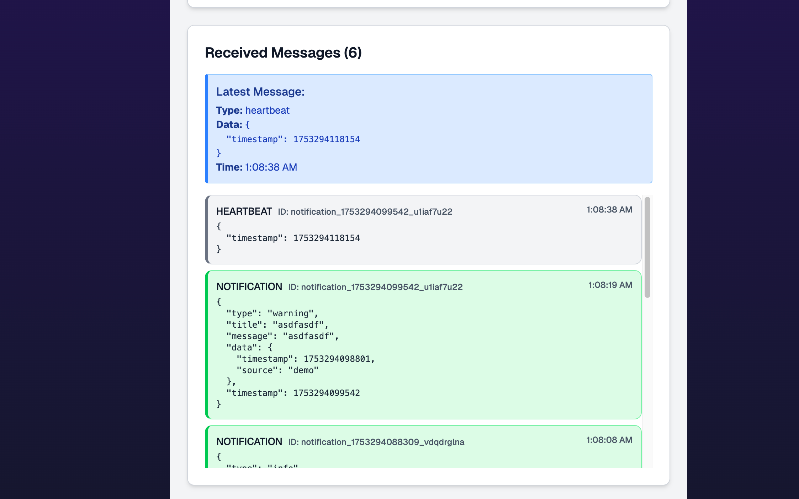

# Nomey Web App

This is the official repository for the Nomey web app, built on the T3 Stack with custom extensions.

## Tech Stack

- [Next.js](https://nextjs.org) - App Framework
- [NextAuth.js](https://next-auth.js.org) - Authentication
- [Prisma](https://prisma.io) - Database ORM
- [Tailwind CSS](https://tailwindcss.com) - CSS Utility Framework
- [tRPC](https://trpc.io) - API Framework
- [Mux]() - Video handling (upload / storage / etc.)
- [tolgee](https://tolgee.io/) - Translation Management
- [Meilisearch](https://www.meilisearch.com/) - Full-text search
- [Upstash](https://upstash.com/) Next compatible redis
- [Qstash](https://upstash.com/docs/qstash) Next compatible queue handling
- [Vitest](https://vitest.dev/) - Testing Framework

## Testing

This project uses [Vitest](https://vitest.dev/) to run both client-side (browser) and server-side (Node.js) tests.

### Project Structure

Tests are split into two environments:

- **Browser (jsdom)** — for React/browser environment tests.
- **Node.js** — for backend and server-only logic.

### File Naming Conventions

- Node-specific tests: `*.node.test.ts`
- Browser tests: any other `*.test.ts`, `*.test.tsx`, etc.

### Running Tests

Run **all tests**:

```bash
npm run test
```

## Local Development

### Clone and Install

```bash
git clone git@github.com:nomeyy/nomey-next.git
cd nomey-next
npm install
```

### Run Containers

You'll need to have `docker` installed locally. We advise running `./scripts/start-services.sh` to safely start your environment, but a normal docker workflow will also work.

### Run Next

```bash
npm run dev
```

> ⚠️ **Warning:** The T3 stack hard-enforces environment variables to provide type-safety. The project will not build without all environment variables in place. Contact a dev to get their variables to quickly get yourself up and running.

## My Updates

We've recently added several major features to enhance the Nomey web app experience:

### Real-Time Notifications System (SSE)

Implemented a comprehensive Server-Sent Events system that provides real-time notifications and system updates to users. This includes:

- **Live Notifications**: Success, error, warning, and info notifications delivered instantly
- **Broadcast Messages**: System-wide announcements to all connected users
- **User Mentions**: Real-time notifications when users are mentioned in comments or posts
- **Video Processing Updates**: Live status updates for video upload and processing
- **Document Collaboration**: Real-time notifications for collaborative document editing

The system includes a demo page at `/sse-demo` where you can test the real-time functionality and view connection statistics.



### Video Upload System (Reels)

Added a new video upload feature for creating and sharing reels:

- **Mux Integration**: Seamless video upload using Mux's robust video infrastructure
- **Progress Tracking**: Real-time upload progress with visual feedback
- **Automatic Processing**: Videos are automatically processed and optimized for playback
- **User Authentication**: Secure upload system requiring user authentication

Access the upload interface at `/reels/upload` to start creating video content.



### Email Templates System

Developed a comprehensive email system using React Email and Resend:

- **React Email Templates**: Modern, responsive email templates built with React components
- **Template Management**: Organized template system with props validation and type safety
- **Development Tools**: VS Code integration for live email preview during development
- **Delivery Service**: Reliable email delivery through Resend integration



### Additional Notes

- All new features include comprehensive error handling and logging
- The SSE system automatically handles connection management and reconnection
- Video uploads support various formats and include automatic optimization
- Email templates are fully responsive and tested across major email clients
- Development mode includes helpful debugging tools and test functionality

These updates significantly enhance the real-time capabilities and content creation features of the Nomey platform, providing users with a more interactive and engaging experience.

## Learn More

- [Nomey Documentation (WIP)](https://nomey.mintlify.app/)
- [Next Documentation](https://nextjs.org/docs)
- [T3 Stack Documentation](https://create.t3.gg/en/usage/first-steps)
- [Mux Documentation](https://www.mux.com/docs)
